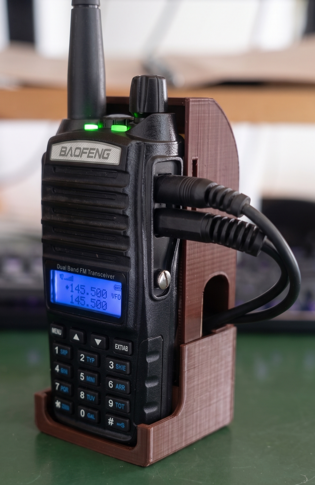
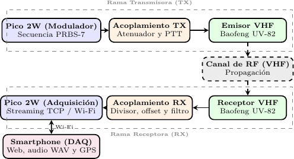
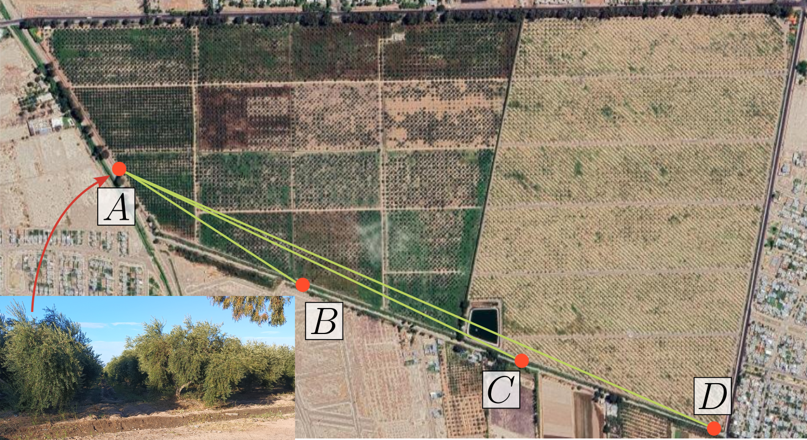
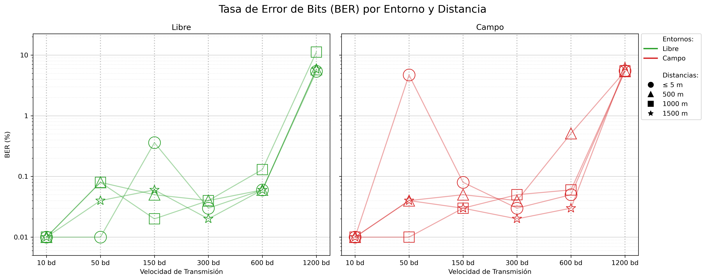

# 🌐 Outdoor Radio Robotics (ORR)

> **Módem digital AFSK de código abierto para telemetría robótica sobre transceptores analógicos VHF/UHF en entornos agrícolas con alta densidad de follaje.**

Este repositorio contiene el diseño de *hardware*, el *firmware* embebido y la suite de procesamiento digital de señales de la plataforma **ORR** (*Outdoor Radio Robotics*). El sistema ha sido desarrollado en el **Instituto de Automática (INAUT)** de la **Universidad Nacional de San Juan (UNSJ)** y sirve como material complementario y de validación experimental para posibilitar una comunicación digital de enjambres robóticos e instrumentación en agricultura de precisión.

---

## 📝 Descripción del Proyecto

El despliegue de plataformas robóticas autónomas en entornos agrícolas reales (como olivares o viñedos) enfrenta atenuación electromagnética en las bandas tradicionales de $2.4\text{ GHz}$ o $5.8\text{ GHz}$ debido a la absorción por la biomasa y el follaje húmedo. Para sortear esta limitación física, el proyecto **ORR** propone una arquitectura de acoplamiento no intrusiva que convierte transceptores analógicos de FM comerciales (como el **Baofeng UV-82**) en radio-módems digitales de datos en las bandas de VHF/UHF.

<p align="center">
  
</p>

Mediante el uso de un microcontrolador (**Raspberry Pi Pico 2W**), se implementa un módem AFSK (*Audio Frequency Shift Keying*) a velocidades de hasta 1200 baudios. El sistema se comporta como un bloque físico autónomo que reduce los costos de equipamiento en más de dos órdenes de magnitud respecto a transceptores tácticos industriales.

<p align="center">
  
</p>

---

## 🛠️ Características Principales

### 1. Acondicionamiento Analógico de *Hardware*
* **Alimentación Unificada:** El microcontrolador se alimenta directamente de la batería de Li-ion del transceptor (7.4 V nominales) mediante un regulador lineal de bajo descarte (LDO), eliminando fuentes de energía secundarias.
* **Aislamiento Galvánico:** Se implementa un aislamiento en la línea de control de transmisión PTT (*Push-To-Talk*) mediante un optoacoplador PC817. Las líneas de audio analógicas emplean un acople AC capacitivo y divisores de tensión específicos para evitar la saturación del amplificador de la radio y proteger las entradas del ADC de la placa Pico 2W.
* **Prevención de Bucles de Masa:** Las masas analógicas y digitales se aíslan en el diseño del conector *jack* de audio, suprimiendo ruidos de conmutación electromagnética que degradarían la relación señal-ruido (SNR).

### 2. Gabinete Mecánico Impreso en 3D
* **Diseño Protector:** Carcasa diseñada para impresión 3D en PLA o PETG que protege la electrónica discreta contra las vibraciones de la maquinaria agrícola.
* **Encastre Antieyección:** Estructura con ranuras específicas que aseguran físicamente el pestillo de liberación de la batería de la radio, previniendo desconexiones accidentales durante el trabajo de campo.

### 3. *Firmware* Embebido (MicroPython)
* **Lazo de Transmisión *Zero-Allocation*:** Síntesis DDS (*Direct Digital Synthesis*) de tonos mediante una tabla de búsqueda (LUT) senoidal precomputada mapeada a PWM de *hardware* a 125 kHz.
* **Supresión de *Jitter*:** Durante la transmisión de tramas (patrones pseudoaleatorios PRBS-7), el recolector de basura (*garbage collector*) se deshabilita temporalmente con `gc.disable()`, asegurando un flujo libre de derivas temporales no deterministas.
* **Protección Térmica Activa:** Máquina de estados finitos que limita la transmisión continua a un máximo de 30 segundos, forzando un ciclo de enfriamiento pasivo equivalente para prolongar la vida útil del paso final de potencia RF de la radio.
* *****Streaming*** Asíncrono Multilazo:** Lectura en tiempo real del ADC a 19.2 kHz mediante *buffers* dobles (*ping-pong*) en el *Core* 1 de la Pico 2W, mientras que el *Core* 0 gestiona un servidor TCP *socket* embebido sobre Wi-Fi para transmitir los datos de forma inalámbrica a la base del operador.

### 4. Demodulador por Envolventes Balanceadas
* **Demodulación por Envolventes Balanceadas:** Aísla las componentes de frecuencia de $1200\text{ Hz}$ (*Mark*) y $2400\text{ Hz}$ (*Space*) mediante filtros de banda Butterworth de segundo orden adaptados a la velocidad de transmisión, extrayendo sus envolventes de amplitud y restándolas mediante un factor de compensación de ganancia dinámica.
* **Sincronización por Búsqueda de Fase:** Implementa un algoritmo de búsqueda en rejilla (*Grid Search*) que localiza el instante de muestreo de la ráfaga de datos minimizando la tasa de error de bit, manteniendo el espaciamiento de símbolos constante para compensar derivas de fase.
* **Métrica de Confianza ($C_k$):** Cálculo analítico de la diferencia relativa entre las envolventes balanceadas de Mark y Space en cada instante de muestreo, lo que permite evaluar la calidad del bit recuperado directamente en la etapa de decisión.

---

## 📈 Resultados Experimentales de Campo

Los ensayos de campo se realizaron en un olivar de producción intensiva en San Juan, Argentina, inyectando tramas balanceadas PRBS-7 de 127 bits de longitud repetidas de forma continua. Se operó a una potencia de $1.0\text{ W}$ en la frecuencia UHF de $433\text{ MHz}$ con polarización horizontal.




A continuación se resumen los resultados obtenidos a diferentes distancias y velocidades:

| Distancia | Baudrate (Velocidad) | BER (% de Error) | Confianza Promedio ($C_k$) | Comentarios de Canal |
| :---: | :---: | :---: | :---: | :--- |
| **1 m**<br>*(Laboratorio)* | 10 a 1200 bd | 0.00% a 0.51% | 0.998 a 0.795 | Canal ideal, relación señal-ruido elevada. |
| **240 m**<br>*(Borde del Predio)* | 300 bd<br>1200 bd | 1.88%<br>7.45% | 0.731<br>0.375 | Línea de vista parcial. Atenuación de agudos perceptible a alta velocidad. |
| **580 m**<br>*(Bajo Follaje)* | 300 bd<br>1200 bd | 2.17%<br>8.14% | 0.626<br>0.378 | Obstrucción moderada por biomasa. Difracción y atenuación en UHF. |
| **1500 m**<br>*(Largo Alcance)* | **300 bd**<br>1200 bd | **2.39%**<br>44.53% | **0.714**<br>0.350 | **Obstrucción por árboles adultos sin línea de vista. Configuración con tasa de error mínima a 300 bd.** |



---

## 💾 Dataset Experimental y Bases de Datos

Las campañas de medición en campo y laboratorio produjeron un conjunto de datos (*dataset*) de señales de audio digitalizadas y telemetría de geolocalización. Debido al volumen y al tamaño de los archivos de audio crudos (`.wav`), el dataset completo está almacenado en un repositorio compartido externo.

* 🔗 **Acceso al Dataset Completo (Google Drive):** [Bases de Datos de Audio ORR](https://drive.google.com/drive/folders/1wKw8cH1Ox6S6E19gmR8-GltFr6CDUwmw?usp=sharing)
* 📖 **Descripción Detallada:** Para una explicación completa sobre la secuencia pseudoaleatoria PRBS-7, el hardware de adquisición Web-DAQ (Core 1 para ADC y Core 0 para Wi-Fi/streaming), las velocidades ensayadas, el significado de los nombres de los archivos y la distribución de las carpetas, consulte la [Guía Detallada del Dataset](./data/README.md).

---

## 📂 Estructura de Directorios

El repositorio se organiza de la siguiente manera:

```
ORR/
├── assets/              # Imágenes y recursos visuales para la documentación
├── data/                # Dataset experimental (archivos CSV con metadatos GPS e instruciones de audio)
├── firmware/            # Código fuente para Raspberry Pi Pico 2W (MicroPython)
│   ├── tx/              # Firmware del nodo transmisor (DDS, PWM, FSM, PRBS-7)
│   └── rx/              # Firmware del nodo receptor (adquisición en Core 1, servidor TCP en Core 0)
├── hardware/            # Esquemáticos y manual de acondicionamiento de la interfaz analógica
│   └── esquematicos/    # Circuitos y pinout de interconexión
├── mechanics/           # Gabinete protector e interfaz de acople mecánico 3D (STL/STEP)
└── processing/          # Suite de demodulación *offline* en Python (Envolventes, Búsqueda de Fase, BER) y MATLAB
```

---

## 🚀 Cómo Empezar

### Requisitos Previos
* ***Hardware***:
  * Raspberry Pi Pico 2W (o Pico W estándar).
  * Transceptor analógico FM Baofeng UV-82 (o similar con conector tipo Kenwood de dos pines).
  * Componentes discretos detallados en los esquemáticos de la carpeta `hardware/`.
* **Software:**
  * MicroPython v1.20 o superior instalado en el microcontrolador.
  * Suite de demodulación: Python 3.10+ con las librerías indicadas en [processing/requirements.txt](./processing/requirements.txt).

Para instrucciones detalladas de implementación de cada módulo, por favor consulta los archivos `README.md` y guías específicos dentro de cada directorio:
* Ver [firmware/README.md](./firmware/README.md) para la configuración del microcontrolador.
* Ver [hardware/README.md](./hardware/README.md) para el circuito de acoplamiento analógico.
* Ver [processing/README.md](./processing/README.md) para la suite de demodulación espectral y cálculo de BER.
* Ver [processing/workflow_bursts.md](./processing/workflow_bursts.md) para el flujo de trabajo integrado y segmentación automática de ráfagas.
* Ver [data/README.md](./data/README.md) para acceder a los metadatos de GPS y descargar el dataset de audio.

---

## 🎓 Créditos y Citación

Este desarrollo forma parte de la línea de investigación en redes tolerantes a retardos (DTN) aplicadas a la robótica agrícola del **INAUT (UNSJ)**.

Si utiliza este trabajo en su investigación o desarrollo, por favor cite el artículo científico asociado:

```bibtex
@inproceedings{sansoni2026orr,
  author    = {Sansoni, Sebastian},
  title     = {Diseño y Análisis de un sistema de Comunicación Digital sobre Radios Analógicas para Robótica en exteriores},
  booktitle = {Actas de las Jornadas Argentinas de Robótica (JAR)},
  year      = {2026},
  address   = {San Juan, Argentina}
}
```

---

## ⚖️ Licencia

Este proyecto está bajo la licencia **Apache 2.0**. Esto significa que es **código abierto** y libre para cualquier uso (incluyendo comercial, modificación y distribución), con las siguientes garantías clave:
* **Protección de Patentes:** Evita litigios de patentes entre colaboradores y usuarios.
* **Respeto de Marca:** Protege el nombre del proyecto (*Outdoor Radio Robotics*) e institucional (INAUT/UNSJ) frente a usos no autorizados de terceros en software derivado.
