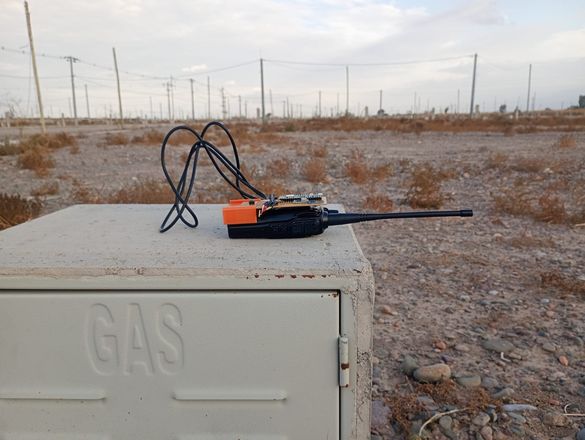

# 🌐 Outdoor Radio Robotics (ORR)

> **Módem digital AFSK de código abierto para telemetría robótica sobre transceptores analógicos VHF/UHF en entornos agrícolas con alta densidad de follaje.**

Este repositorio contiene el diseño de *hardware*, el *firmware* embebido y la suite de procesamiento digital de señales de la plataforma **ORR** (*Outdoor Radio Robotics*). El sistema ha sido desarrollado en el **Instituto de Automática (INAUT)** de la **Universidad Nacional de San Juan (UNSJ)** y sirve como material complementario y de validación experimental para posibilitar una comunicación digital de enjambres robóticos e instrumentación en agricultura de precisión.

---

## 📝 Descripción del Proyecto

El despliegue de plataformas robóticas autónomas en entornos agrícolas reales (como olivares o viñedos) enfrenta atenuación electromagnética en las bandas tradicionales de $2.4\text{ GHz}$ o $5.8\text{ GHz}$ debido a la absorción por la biomasa y el follaje húmedo. Para sortear esta limitación física, el proyecto **ORR** propone una arquitectura de acoplamiento no intrusiva que convierte transceptores analógicos de FM comerciales (como el **Baofeng UV-82**) en radio-módems digitales de datos en las bandas de VHF/UHF.

<p align="center">
  
</p>

Mediante el uso de un microcontrolador (**Raspberry Pi Pico 2W**), se implementa un módem AFSK (*Audio Frequency Shift Keying*) a velocidades de hasta 1200 baudios. El sistema se comporta como un bloque físico autónomo que reduce los costos de equipamiento en más de dos órdenes de magnitud respecto a transceptores tácticos industriales.

<p align="center">
  
</p>

---

## 🛠️ Características Principales

### 1. Acondicionamiento Analógico de *Hardware*
* **Alimentación Unificada:** El microcontrolador se alimenta directamente de la batería de Li-ion del transceptor (7.4 V nominales) mediante un regulador lineal de bajo descarte (LDO), eliminando fuentes de energía secundarias.
* **Aislamiento Galvánico:** Se implementa un aislamiento en la línea de control de transmisión PTT (*Push-To-Talk*) mediante un optoacoplador PC817. Las líneas de audio analógicas emplean un acople AC capacitivo y divisores de tensión específicos para evitar la saturación del amplificador de la radio y proteger las entradas del ADC de la placa Pico 2W.
* **Prevención de Bucles de Masa:** Las masas analógicas y digitales se aíslan en el diseño del conector *jack* de audio, suprimiendo ruidos de conmutación electromagnética que degradarían la relación señal-ruido (SNR).

### 2. Gabinete Mecánico Impreso en 3D
* **Diseño Protector:** Carcasa diseñada para impresión 3D en PLA o PETG que protege la electrónica discreta contra las vibraciones de la maquinaria agrícola.
* **Encastre Antieyección:** Estructura con ranuras específicas que aseguran físicamente el pestillo de liberación de la batería de la radio, previniendo desconexiones accidentales durante el trabajo de campo.

### 3. *Firmware* Embebido (MicroPython)
* **Lazo de Transmisión *Zero-Allocation*:** Síntesis DDS (*Direct Digital Synthesis*) de tonos mediante una tabla de búsqueda (LUT) senoidal precomputada mapeada a PWM de *hardware* a 125 kHz.
* **Supresión de *Jitter*:** Durante la transmisión de tramas (patrones pseudoaleatorios PRBS-7), el recolector de basura (*garbage collector*) se deshabilita temporalmente con `gc.disable()`, asegurando un flujo libre de derivas temporales no deterministas.
* **Protección Térmica Activa:** Máquina de estados finitos que limita la transmisión continua a un máximo de 30 segundos, forzando un ciclo de enfriamiento pasivo equivalente para prolongar la vida útil del paso final de potencia RF de la radio.
* *****Streaming*** Asíncrono Multilazo:** Lectura en tiempo real del ADC a 19.2 kHz mediante *buffers* dobles (*ping-pong*) en el *Core* 1 de la Pico 2W, mientras que el *Core* 0 gestiona un servidor TCP *socket* embebido sobre Wi-Fi para transmitir los datos de forma inalámbrica a la base del operador.

### 4. Demodulador por Envolventes Balanceadas
* **Pipeline Bifurcado por Velocidad:** El pipeline de demodulación se adapta al régimen de baudios detectado.
  - **1200 bd:** Usa filtros `filtfilt` de **fase nula** (*zero-phase*) en las etapas de pasa-banda y pasa-bajos de envolvente, eliminando el retardo de grupo de ~8.8 muestras que causaba ISI sistemático con el método causal clásico. La señal resultante se normaliza geométricamente al rango $[-1, +1]$ usando el punto medio entre percentil 5 y 95 del burst activo, y se aplica un squelch de inicio para evitar el falso enganche del reloj (*false lock*) sobre silencios previos a la ráfaga.
  - **≤ 600 bd:** Usa filtros causales clásicos (`lfilter`), donde el retardo de grupo es despreciable en proporción al período de símbolo.
* **Demodulación por Envolventes Balanceadas:** En ambos casos, las envolventes de amplitud de Mark y Space se compensan con un factor de ganancia dinámica $g$ calculado sobre los percentiles de amplitud del segmento activo: $y = env_{\text{mark}} - g \cdot env_{\text{space}}$.
* **Sincronización DPLL con Grilla Configurable:** La búsqueda de la fase de ráfaga se realiza en una ventana de $1 \times N_s$ muestras (hasta $15 \times N_s$ para 1200 bd), seguida de la sintonización automática del DPLL por grilla sobre los candidatos $K_p$ y $K_i$ definidos en `modules/config.py`. El período de símbolo $N_s = f_s / \text{baud}$ se calcula siempre dinámicamente, sin valores fijos por velocidad.
* **Métrica de Confianza ($C_k$):** Cálculo analítico de la diferencia relativa entre las envolventes balanceadas de Mark y Space en cada instante de muestreo, lo que permite evaluar la calidad del bit recuperado directamente en la etapa de decisión.

---

## 📈 Ensayos y Resultados Experimentales

Para validar el desempeño del módem AFSK y el enlace de radiofrecuencia en condiciones de operación reales, se diseñó y ejecutó una campaña experimental dividida en **dos entornos de ensayo diferenciados** (2 experimentos independientes):

1. **Espacio Abierto (Libre):** Ensayo en línea de vista rural libre de obstáculos y follaje. Sirve como canal de calibración y referencia para evaluar el desempeño básico y el límite térmico/frecuencial del enlace.
2. **Bajo Follaje de Olivos (Campo):** Ensayo realizado en una plantación densa de olivos en la provincia de San Juan, Argentina. El enlace se caracterizó por la total obstrucción de la línea de vista directa debido a la biomasa frutal, con las radios posicionadas a menos de 1 metro del suelo y las antenas polarizadas horizontalmente para evitar la absorción de los troncos verticales.

Ambos experimentos operaron a una potencia de **1.0 W** (Low Power) en la banda UHF a **433 MHz**.

### 1. Entornos de Ensayo

La siguiente ilustración muestra las condiciones físicas de ambos escenarios de medición:

<p align="center">
  
  
</p>

### 2. Georreferenciación de Mediciones (Figura 5 del Paper)

Los puntos específicos de medición, capturados y georreferenciados mediante el Web-DAQ en el teléfono celular del operador, se ubican a distancias nominales de **5 m, 500 m, 1000 m y 1500 m** en la plantación:

<p align="center">
  
</p>

### 3. Tasa de Error de Bit (BER)

A continuación se consolidan los resultados de la Tasa de Error de Bit (BER %) obtenidos en cada entorno para las diferentes distancias reales y regímenes de velocidad (baudrate) analizados:

#### Experimento 1: Espacio Abierto (Libre)
| Distancia Real (Nominal) | 10 bd | 50 bd | 150 bd | 300 bd | 600 bd | 1200 bd |
| :---: | :---: | :---: | :---: | :---: | :---: | :---: |
| **0 m** (5 m) | 0.00% | 0.00% | 0.36% | 0.03% | 0.06% | 5.39% |
| **552 m** (500 m) | 0.00% | 0.08% | 0.05% | 0.04% | 0.06% | 5.80% |
| **985 m** (1000 m) | 0.00% | 0.08% | 0.02% | 0.04% | 0.13% | 11.20% |
| **1382 m** (1500 m) | 0.00% | 0.04% | 0.06% | 0.02% | 0.06% | 5.80% |

#### Experimento 2: Bajo Follaje de Olivos (Campo)
| Distancia Real (Nominal) | 10 bd | 50 bd | 150 bd | 300 bd | 600 bd | 1200 bd |
| :---: | :---: | :---: | :---: | :---: | :---: | :---: |
| **0 m** (5 m) | 0.00% | 4.69% | 0.08% | 0.03% | 0.05% | 5.49% |
| **549 m** (500 m) | 0.00% | 0.04% | 0.05% | 0.04% | 0.51% | 5.40% |
| **1071 m** (1000 m) | 0.00% | 0.00% | 0.03% | 0.05% | 0.06% | 5.46% |
| **1484 m** (1500 m) | 0.00% | 0.04% | 0.03% | 0.02% | 0.03% | 6.33% |

El comportamiento y la comparación visual del BER de ambos entornos se detalla en las curvas experimentales (subplots) obtenidas:

<p align="center">
  
</p>

---

## 💾 Dataset Experimental y Bases de Datos

Las campañas de medición en campo y laboratorio produjeron un conjunto de datos (*dataset*) de señales de audio digitalizadas y telemetría de geolocalización. Debido al volumen y al tamaño de los archivos de audio crudos (`.wav`), el dataset completo está almacenado en un repositorio compartido externo.

* 🔗 **Acceso al Dataset Completo (Google Drive):** [Bases de Datos de Audio ORR](https://drive.google.com/drive/folders/1wKw8cH1Ox6S6E19gmR8-GltFr6CDUwmw?usp=sharing)
* 📖 **Descripción Detallada:** Para una explicación completa sobre la secuencia pseudoaleatoria PRBS-7, el hardware de adquisición Web-DAQ (Core 1 para ADC y Core 0 para Wi-Fi/streaming), las velocidades ensayadas, el significado de los nombres de los archivos y la distribución de las carpetas, consulte la [Guía Detallada del Dataset](./data/README.md).

---

## 📂 Estructura de Directorios

El repositorio se organiza de la siguiente manera:

```
ORR/
├── assets/              # Imágenes y recursos visuales para la documentación
├── data/                # Dataset experimental (archivos CSV con metadatos GPS e instruciones de audio)
├── firmware/            # Código fuente para Raspberry Pi Pico 2W (MicroPython)
│   ├── tx/              # Firmware del nodo transmisor (DDS, PWM, FSM, PRBS-7)
│   └── rx/              # Firmware del nodo receptor (adquisición en Core 1, servidor TCP en Core 0)
├── fotos/               # Fotografías de los entornos experimentales (libre y campo)
├── hardware/            # Esquemáticos y manual de acondicionamiento de la interfaz analógica
│   └── esquematicos/    # Circuitos y pinout de interconexión
├── mechanics/           # Gabinete protector e interfaz de acople mecánico 3D (STL/STEP)
└── processing/          # Suite de demodulación *offline* en Python (Envolventes, Búsqueda de Fase, BER) y MATLAB
```

---

## 🚀 Cómo Empezar

### Requisitos Previos
* ***Hardware***:
  * Raspberry Pi Pico 2W (o Pico W estándar).
  * Transceptor analógico FM Baofeng UV-82 (o similar con conector tipo Kenwood de dos pines).
  * Componentes discretos detallados en los esquemáticos de la carpeta `hardware/`.
* **Software:**
  * MicroPython v1.20 o superior instalado en el microcontrolador.
  * Suite de demodulación: Python 3.10+ con las librerías indicadas en [processing/requirements.txt](./processing/requirements.txt).

Para instrucciones detalladas de implementación de cada módulo, por favor consulta los archivos `README.md` y guías específicos dentro de cada directorio:
* Ver [firmware/README.md](./firmware/README.md) para la configuración del microcontrolador.
* Ver [hardware/README.md](./hardware/README.md) para el circuito de acoplamiento analógico.
* Ver [processing/README.md](./processing/README.md) para la suite de demodulación espectral y cálculo de BER.
* Ver [processing/workflow_bursts.md](./processing/workflow_bursts.md) para el flujo de trabajo integrado y segmentación automática de ráfagas.
* Ver [data/README.md](./data/README.md) para acceder a los metadatos de GPS y descargar el dataset de audio.

---

## 🎓 Créditos y Citación

Este desarrollo forma parte de la línea de investigación en redes tolerantes a retardos (DTN) aplicadas a la robótica agrícola del **INAUT (UNSJ)**.

Si utiliza este trabajo en su investigación o desarrollo, por favor cite el artículo científico asociado:

```bibtex
@inproceedings{sansoni2026orr,
  author    = {Sansoni, Sebastian},
  title     = {Diseño y Análisis de un sistema de Comunicación Digital sobre Radios Analógicas para Robótica en exteriores},
  booktitle = {Actas de las Jornadas Argentinas de Robótica (JAR)},
  year      = {2026},
  address   = {San Juan, Argentina}
}
```

---

## ⚖️ Licencia

Este proyecto está bajo la licencia **Apache 2.0**. Esto significa que es **código abierto** y libre para cualquier uso (incluyendo comercial, modificación y distribución), con las siguientes garantías clave:
* **Protección de Patentes:** Evita litigios de patentes entre colaboradores y usuarios.
* **Respeto de Marca:** Protege el nombre del proyecto (*Outdoor Radio Robotics*) e institucional (INAUT/UNSJ) frente a usos no autorizados de terceros en software derivado.
